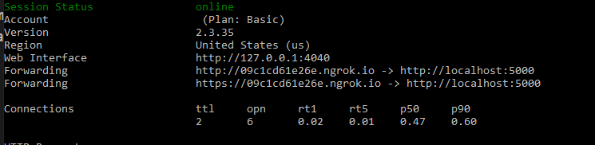
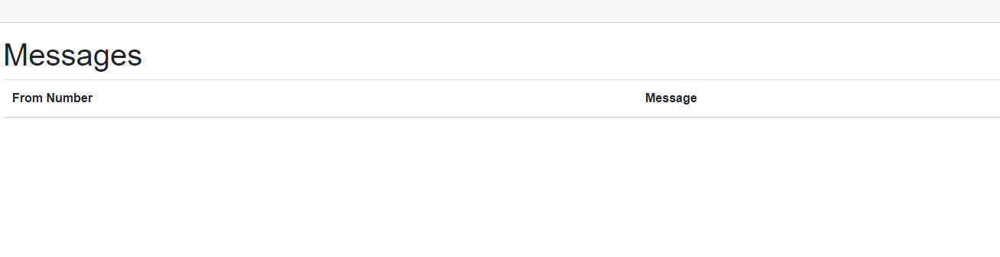
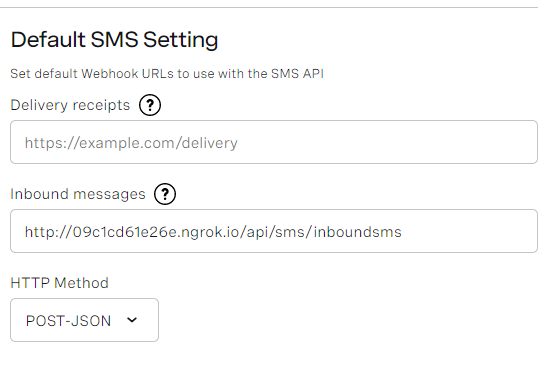
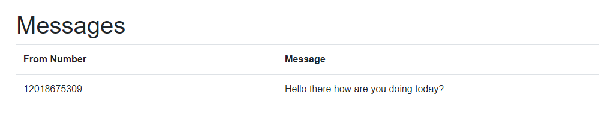

# Project Name


This repository demonstrates how to receive an SMS message with Blazor. It contains an asp.net server that, when run, will listen on an InboundSms route and push inbound sms's to any browser's connected to the server.

## Welcome to Vonage

If you're new to Vonage, you can [sign up for a Vonage API account](https://dashboard.nexmo.com/sign-up?utm_source=DEV_REL&utm_medium=github&utm_campaign=receive-sms-blazor) and get some free credit to get you started.

## Prerequisites

* You'll need a Vonage API account. You can [sign up here](https://dashboard.nexmo.com/sign-up)
* You'll need the latest version of the [.NET Core 3.1 SDK](https://dotnet.microsoft.com/download/dotnet-core/3.1)

## Testing with Ngrok

If you are using ngrok with IIS express I'd encourage you to check out our [explainer on the subject](https://developer.nexmo.com/tools/ngrok#usage-with-iis-express) as there are special considerations. For the purposes of this demo, since we are using the dotnet CLI we don't need to worry about this. Run the following command in a separate console.

```bash
ngrok http 5000
```

This will build a tunnel to that port. You can now run your application by using the `dotnet run` command. Check back at your ngrok console it will tell you the publicly accessible URL of your app.



In this case it's pointing to `http://09c1cd61e26e.ngrok.io/`, by navigating to that URL you can actually see the application's frontend.



## Configure your Webhooks

The route to our inbound sms webhook would be /api/sms/inboundsms. This means that the full route is going to be `http://09c1cd61e26e.ngrok.io/api/sms/inboundsms`. All that's need to do now is navigate to [settings page](https://dashboard.nexmo.com/settings) and set the inbound messages url to our route, and set the http method to `POST-JSON`. Click the `Save Changes` button at the bottom.



## Test

In order to test, all that's needed is to send a text message to a Vonage API Number associated with your account. That can be found on the dashboard under [numbers->Your Number](https://dashboard.nexmo.com/your-numbers).

When all is said and done it will look something like this.



## Getting Help

We love to hear from you so if you have questions, comments or find a bug in the project, let us know! You can either:

* Open an issue on this repository
* Tweet at us! We're [@VonageDev on Twitter](https://twitter.com/VonageDev)
* Or [join the Vonage Developer Community Slack](https://developer.nexmo.com/community/slack)

## Further Reading

* Check out the Developer Documentation at <https://developer.nexmo.com>

<!-- add links to the api reference, other documentation, related blog posts, whatever someone who has read this far might find interesting :) -->
